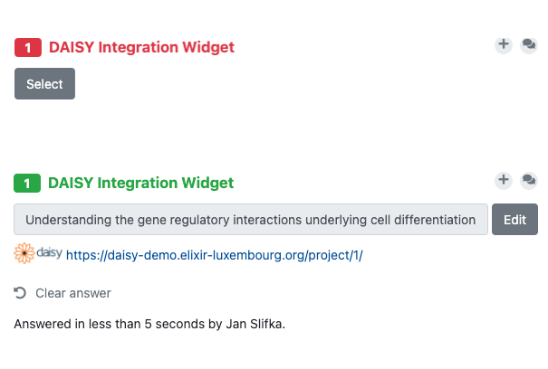

# Abstract

This report summarizes our activities and achievements in integrating the Data Stewardship Wizard (DSW) and Data Information System (DAISY) tools during the ELIXIR BioHackathon Europe 2021. As a data information system for GDPR compliance, DAISY is focused on a single goal – gathering all information required for GDPR compliance. On another hand, DSW is very flexible and can be used beyond data management planning. We worked on the integration between both tools on two fronts. Firstly, we created a new Knowledge Model in DSW together with a document output template to be able to generate a data protection impact assessment (DPIA). Secondly, we introduced a new integration type between projects in DSW and DAISY that allows the querying of DAISY data upon document generation in DSW. Both of these independent activities brought successful results that were polished and published after the actual BioHackathon. Finally, we provide the related materials as an on-demand training course in the ELIXIR e-Learning Platform.

# Introduction

The GDPR requires research projects with sensitive human data to perform a data protection impact assessment (DPIA) for documenting the project’s data protection risks and corresponding safeguards. Data stewards across Europe are tasked to support researchers with DPIAs, which occur commonly in tandem with data management planning. Two ELIXIR tools fall in the data protection realm. [Data Stewardship Wizard (DSW)](https://ds-wizard.org) [@dswPaper], which for now is used mainly to help in data management planning, raises awareness for data protection requirements such as the DPIA. However, it is not specialised in DPIA reporting. The [Data Information System (DAISY)](https://elixir.pages.uni.lu/daisy-doc/) [@daisyPaper], which allows institutions to keep a register of their projects using sensitive data, stores structured information on the project’s GDPR-relevant aspects – the crucial input to a DPIA. Meanwhile, DAISY lacks the means to combine the project facts into the narrative response needed in a DPIA.

As the DSW and DAISY are highly complementary, we decided to integrate the two to support DPIAs in DSW. The integration has been designed in two independent tasks:

1. **DPIA in DSW (Content-Based Integration)**: Allows to create a DPIA directly in DSW by introducing a new Knowledge Model (questionnaire structure) and a corresponding document output template. Thus, users may create a DPIA project in DSW, fill in the information, and generate a DPIA document. Also, working with DSW, users will benefit from all its intrinsic features like version history, collaboration, comments, and others.
2. **Querying DAISY Data in DSW (Technical Integration)**: Enables linking to a project in DAISY from within a project in DSW and so querying the DAISY project details using an API when necessary. The goal is to benefit from DAISY GDPR-specific features and allow users to use those when generating documents in DSW. For example, one can then add to the data management plan (DMP) an appendix that exclusively deals with GDPR compliance.

To support and disseminate the use of our integration work, we also planned to compose a brief on-demand training course in the ELIXIR e-Learning Platform. Training on DPIAs has already been identified as a gap by the ELIXIR Training Platform.

# DPIA in DSW

Writing a data protection impact assessment for a scientific project is a challenging task. Input from multiple key groups is required to obtain complete and precise information. In addition to data stewards, which are commonly the ones in charge of the information collection since their knowledge overlaps all other involved domains, the process involves researchers themselves bringing knowledge of about the actual data and related scientific processes, data managers and IT staff describing the local IT infrastructures and external collaborators reporting on the shared data processing tasks. Finally, legal representatives (e.g. data protection officer) validates the resulting document with existing contracts, institutional policies and approves the final version.

DPIA is commonly written using spreadsheet or text based templates with questions and predefined answers. This approach suffers from the absence of branching logic, overwhelming and poorly structured content and lack of support for collaborative editing. Furthermore, subsequent updates of the template make the whole process laborious and unnecessarily complex. Dedicated tools (e.g. [Processing Impact Assessment](https://www.cnil.fr/en/open-source-pia-software-helps-carry-out-data-protection-impact-assesment) from Commission Nationale de l'Informatique et des Libertés (CNIL)) are also available and they do bring substantial help but they in general lack the ability of full customization of the template.

DSW offers variety of needed functionalities for DPIA document generation. It provides user access and project visibility control, which are necessary features since the DPIA content is often confidential. DSW supports creation of versioned structured questionnaire with a complex branching logic. Questions can be interlinked, accompanied by extensive explanation, hints, predefined answers and guidance and enriched by links to external sources (e.g. specific GDPR content) or integrations to local or external vocabularies. The smooth collaboration is possible thanks to ability to add comments on each question.

Finally, as both data management plan and data protection impact assessment are usually composed by the same group of people at the same phase of the research project, using DSW for DPIA generation is very convenient as users can work in only one familiar environment.

## Creating a DPIA Knowledge Model

The DPIA knowledge model is mainly inspired by the several existing documents, namely the [CNIL DPIA document template](https://www.cnil.fr/sites/default/files/atoms/files/cnil-pia-2-en-templates.pdf), the DPIA document template used by the Luxembourg Centre for Systems Biomedicine and [ICO guidance](https://ico.org.uk/for-organisations/guide-to-data-protection/guide-to-the-general-data-protection-regulation-gdpr/data-protection-impact-assessments-dpias/how-do-we-do-a-dpia/#how)) on data protection.

The first chapter collects administrative information and description of method followed for during project's DPIA. Following chapters contain questions related to:

* The identification of the need for a DPIA
* The nature, scope, context and purposes of the processing of data, as well as the list of related responsibilities
* The data processes and supporting assets
* The proportionality and necessity of the processing
* The measures taken to protect the rights of the subjects
* The identification, analysis, and evaluation of the data risks factors and the measures and controls to mitigate those risks

Although a risk assessment is very important part of a DPIA, our knowledge model is addressing it very briefly only by questions on general controls which are or will be in place. As risks generally depend on the used infrastructure and involved institutional units, they are globally applicable to all the processing under same institute. We propose process, where the risk assessment matrix can be generated by in-house or external professionals using dedicated tools (e.g. [Monarc](https://www.monarc.lu/)) and reused for each DPIA as a resource. For this purpose, our knowledge model includes question to provide link to such a document.

Lastly, our knowledge model was designed with user experience in mind. Complex branching logic, question description and guidance allow users to fill the questionnaire without additional help.

The final version of the DPIA knowledge model will be released through the DSW registry.

## DPIA Document Template

We used the [Template Development Kit (TDK)](https://github.com/ds-wizard/dsw-tdk) provided by DSW for the creation and the customization of the template; recommendations and hints can be found [here](https://docs.ds-wizard.org/en/latest/dev/templates.html).

As a proof of concept, we have implemented DSW template which produces document matching the [CNIL Template](https://www.cnil.fr/sites/default/files/atoms/files/cnil-pia-2-en-templates.pdf). This template was chosen for its completeness and wide user base. Complexity of the knowledge model ensures the information required by other existing institutional DPIA templates is collected and new DSW templates can be implemented by the community.

# Querying DAISY Data in DSW

The other independent approach that we decided to implement uses linking a DAISY project from DSW and then querying data using DAISY API when needed. The overal idea is shown in the figure below. User of DSW works on its project (with a goal to get a DMP but not limited to it) and in the questionnaire selects using an integration question one of the projects in DAISY. Now, the project from DAISY is linked via its link stored as a reply in DSW project. When user wants to produce a document, e.g., a DMP or a report, current DAISY project data are queried using DAISY REST API and transformed into the desired format. The user gets a document with data from DAISY project appropriately included within the other data originated directly from replies in DSW.

With such approach, data in DAISY can be independently changed while selected project in DSW remains the same (as reply in a questionnaire). Creating a document makes a snapshot of both DSW and DAISY projects using the selected document template. First, we needed to investigate how integration question in DSW can be used and how it must be extended to allow users select own projects from DAISY. Then, we had to solve how get the data from DAISY inside a DSW document template that uses [Jinja2 language](https://jinja.palletsprojects.com).

## Integration Question for DAISY Projects

DSW already supports integration question since v1.6.0 (April 2019). It allows to query a REST API for type hints – as user types reply, it suggests answers provided from the API response, and user can select the reply from integration. The advantage is configurability of the integrations and the stored ID of selected item. On the other hand, it does not allow any form of user authentication towards the external API nor more complex item selection than just regular input dropdown. In Figure X **TODO: fix number**, you can see how the integration works for selecting affiliation from [Research Organization Registry (ROR)](https://ror.org).

We tried that it is possible to create such an integration for DAISY projects. However, it has two pitfalls:

1. To access the API, secret token must be used for authorization. Everyone who wanting to have such a question (or whole knowledge model) in their DSW instance would need to acquire such token and place it into server configuration file.
2. As there is no way to distinguish specific users, it must provide all (published) projects from DAISY. The natural behavior -- displaying only projects related to the user filling the questionnaire -- is not achievable.

To overcome these two issues, we designed a new type of integration question described in the following subsection.

## DSW Widget Integrations

Although the integration question was a good start, we needed some improvements. The main issue was that the standard integration question in DSW connects to a public API of an external service to find the results. However, in DAISY, users need to log in first to access their projects. So the standard solution was not suitable unless all of the projects in DAISY were public, which would not be desirable.

Therefore, we came up with the idea of an integration widget. Instead of a search field in DSW, we can open a popup window with a web page implemented on the connected service side, in this case, DAISY. The implementation of the widget itself is the responsibility of the connected service. That means that any necessary functionality, such as login, can be implemented.

We implemented the [DSW Integration Widget SDK](https://github.com/ds-wizard/dsw-integration-widget-sdk), a JavaScript library that is a wrapper for sending the selected options back to DSW, and corresponding supporting code on the DSW side. The library and DSW uses JavaScript `Window.postMessage()` under the hood for the communication between DSW and the popup window with the widget. Besides sending the answers back to DSW, the library also checks whether the widget was invoked from the allowed DSW instance to avoid leaking information somewhere unwanted.

Once the question is answered using the widget, it works in the same way as the standard integration question regarding how it is saved. We save the name of the project retrieved from DAISY and the url to the project so it can be used for further processing.

## Widget for DAISY Projects

The widget implemented on DAISY's side allows users to select one of existing projects and send them back as an answer to DSW. When the widget is opened in a popup window, user is asked to log into Daisy. As the initial page is actual Daisy login form, user needs to use the Daisy login credentials. Once logged in, user is redirected to `/integrations/dsw/list-projects` Daisy endpoint presenting a list of projects he has access to. The list contains only records for which the user is appointed to as local custodian or personnel. The internal Daisy project ID, project's acronym and full title is presented. When a project of interest is clicked on, the popup window is closed, and the information is set in DSW.

## Retrieving Data for Document Generation

To allow retrieving project data from DAISY using its REST API, we had to allow making HTTP requests from Jinja2 templates. It has been added as a new feature to the [DSW Document Worker](https://github.com/ds-wizard/document-worker) component. As it is written in Python programming language, we decided to use the well-known [Requests library](https://docs.python-requests.org/en/latest/). Because any data steward can upload own template and creating requests might be harmful, we also designed a configuration for the document worker that can enable this feature for specific templates (based on their IDs), set limit and timeout for the HTTP requests made from Jinja2.

To make limits and timeouts effective, we had to introduce a simple wrapper class around requests library. An object of such class is then passed as variable into a Jinja2 template if the feature is enabled. On each requests through the object, a counter is increased and check against the limit. The configured timeout is plainly passed to the call of Requests library functions. It does not support any sessions as it is expected that just a single request (or few consecutive requests) will be made in behalf of document generation speed. A HTTP requests can be made from a Jinja2 template in the way shown in Figure X **TODO: fix number**.

## DPIA Appendix Template using DAISY

Using the HTTP requests enabled in document templates, we implemented the [DPIA Appendix Template](https://github.com/ds-wizard/daisy-appendix-template) that can be easily re-used in other DSW document templates. It is based on the example KM where is only a single question that asks for the DAISY project using the widget integration. However, the template is designed in a way that its central part is a re-usable Jinja2 `macro`. Anyone can take this part of the template, include it in their own one and call this macro using DAISY project identifier as an argument.

The macro itself makes three HTTP requests to DAISY API: retrieve project details, retrieve datasets for the project, and retrieve contracts for the project. If all of these three requests are successful, the DPIA appendix is rendered as a structured set of tables. Again, the rendering of separate tables is done using macros, so if someone needs to change the rendering, they can adjust some of the macros in the appendix template. In the end, one may use just the main macro for retrieving data from DAISY and write the whole rendering part on its own. All macros and parts of the appendix template are documented both in README and using Jinja2 comments.

# Training Materials in EeLP

As a part of our work, we also created a new on-demand course in the [ELIXIR-SI e-Learning Platform](https://elixir.mf.uni-lj.si). The course contains basic information about the outcomes of the BioHackathon and how to use them. It also summarizes some critical aspects of the related topics such as Data Stewardship, GDPR Compliance, Data Management Plans, or Data Protection Impact Assessment. We plan to extend the course in the future once the results (of tasks 1 and 2) are polished and recommended for wide use.

The EeLP is based on the well-known [Moodle](https://moodle.org) learning management system. As such, it allows to improve the content continuously and add different types of activities and resources. We also plan to include a quiz or feedback for better user engagement in the future.

# Conclusions and Future Steps

We achieved to complete both tasks that we initially set. The custom DPIA Knowledge Model in DSW, together with the related document template, can be used to create a project in DSW and answer questions to get the DPIA document. Both of these deliverables will need final polishing, e.g., styling the document template, and then can be published. We plan to publish them on GitHub (the template) as well as using [DSW Registry](https://registry.ds-wizard.org) service so anyone can easily pull it to their own DSW instance. In this way, both can be easily updated and maintained over time, and others will quickly get the latest versions.

The second task brought new features to DSW. The integration question with widget still need some adjustments on the backend side of DSW (making it a new type of integration question); however, it is fully operational. The feature enabling HTTP requests from document templates are finalized, and it may be enhanced in the future if needed. Both of these features were released in version 3.6.0 of DSW. The widget implementation on the DAISY side also became directly part of the codebase, and [DSW Integration Widget SDK](https://github.com/ds-wizard/dsw-integration-widget-sdk) has been published on [npmjs.com](https://www.npmjs.com/package/@ds-wizard/integration-widget-sdk). Finally, the DPIA appendix template is ready to be (re-)used and further developed as any other DSW document template.

# Acknowledgements

This work was done during the BioHackathon Europe 2021 organized by ELIXIR in November 2021. We thank the organizers and fellow participants. The development and operation of DSW is supported by ELIXIR CZ research infrastructure (MEYS Grant No. LM2018131) and ELIXIR-CONVERGE (H2020 No. 871075).  

# References
